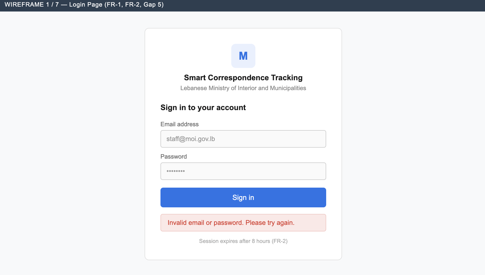
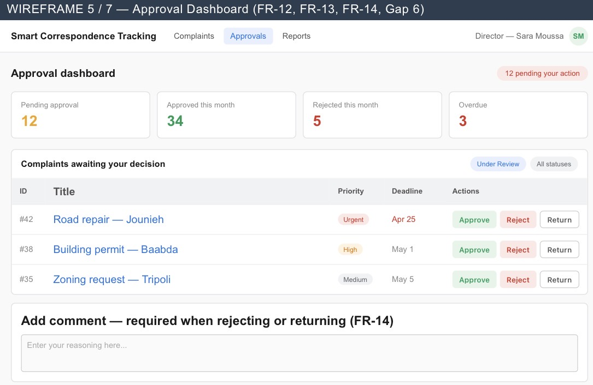
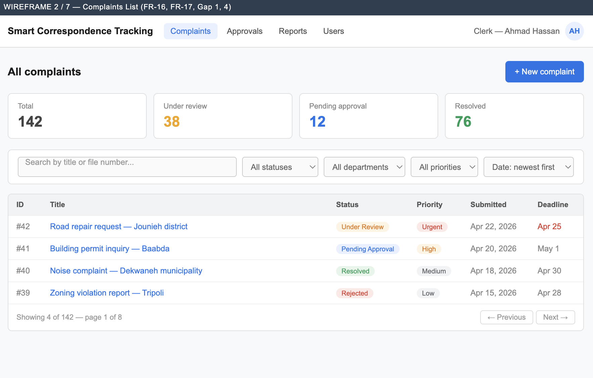
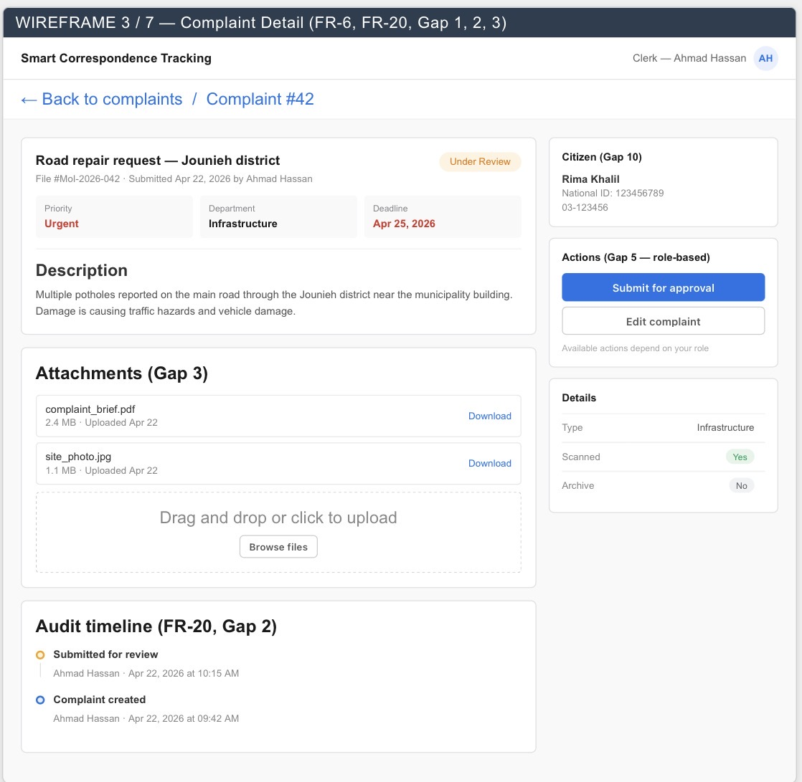
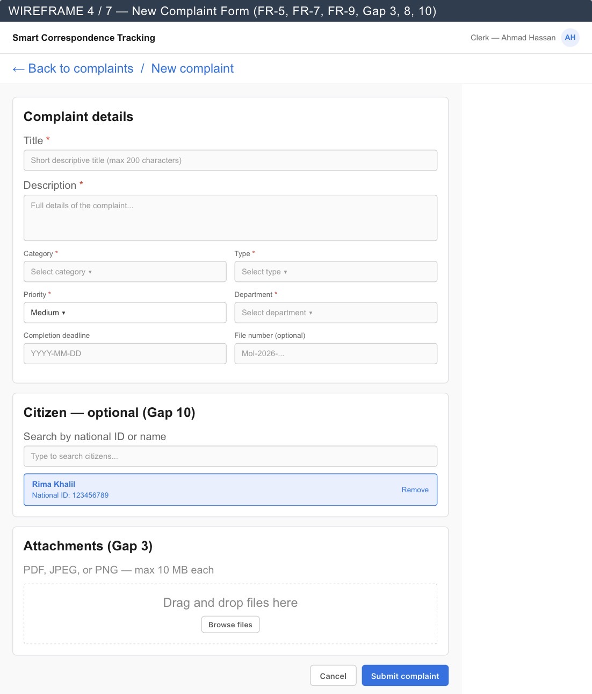
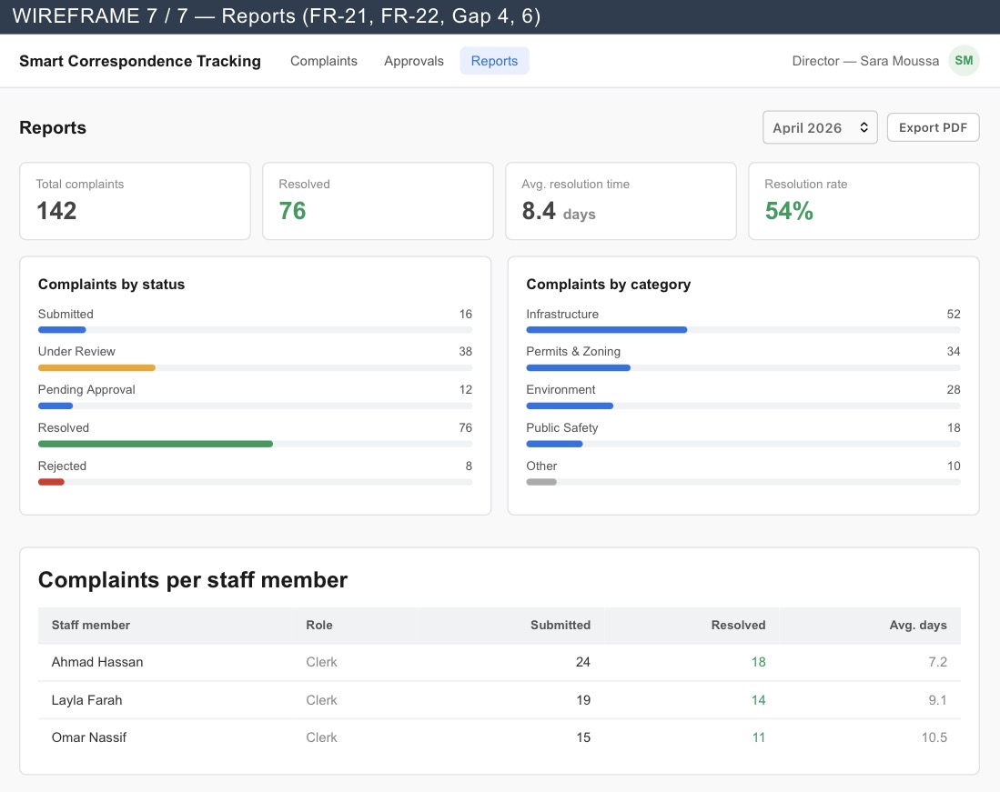

# Smart Correspondence Tracking System
### CSC 599 Capstone — Lebanese Ministry of Interior and Municipalities

**Authors:** Karim Khalil (202203461) · Jalal Al Arab (202302949)  
**Supervisor:** Dr. Farhat  
**Stack:** React 18 · Node.js / Express · MySQL · JWT · bcrypt

> A web-based replacement for a 24-year-old Arabic Oracle Forms system (2002 build, still in use in 2026). The new system modernises complaint intake, approval routing, audit logging, and reporting for Ministry staff — in English, with a clean role-based UI.

---

## Table of Contents

1. [Screenshots](#screenshots)
2. [Prerequisites](#prerequisites)
3. [Setup — 5-minute guide](#setup--5-minute-guide)
4. [Demo accounts](#demo-accounts)
5. [Usage guide](#usage-guide)
6. [API overview](#api-overview)
7. [Project structure](#project-structure)
8. [Running the tests](#running-the-tests)

---

## Screenshots

| Login | Dashboard (Director) |
|---|---|
|  |  |

| Complaints List | Complaint Detail |
|---|---|
|  |  |

| New Complaint | Reports |
|---|---|
|  |  |

---

## Prerequisites

| Tool | Version | Notes |
|---|---|---|
| Node.js | ≥ 18 | `node -v` to check |
| npm | ≥ 9 | bundled with Node |
| MySQL | ≥ 8 | XAMPP works fine |
| Git | any | for cloning |

---

## Setup — 5-minute guide

### 1. Clone the repository

```bash
git clone https://github.com/karimk223/Capstone-Project-Jalal-Karim.git
cd Capstone-Project-Jalal-Karim
```

### 2. Create the database

Open phpMyAdmin (or any MySQL client) and run:

```sql
CREATE DATABASE IF NOT EXISTS ministry_complaints
  CHARACTER SET utf8mb4
  COLLATE utf8mb4_unicode_ci;
```

Then import the schema:

```bash
mysql -u root -p ministry_complaints < schema.sql
```

Or paste the contents of `schema.sql` into the phpMyAdmin SQL tab and click **Go**.

### 3. Configure the backend environment

```bash
cd backend
cp .env.example .env
```

Open `.env` and set your MySQL password:

```
DB_HOST=localhost
DB_PORT=3306
DB_USER=root
DB_PASSWORD=your_mysql_password   # ← change this
DB_NAME=ministry_complaints
JWT_SECRET=any_long_random_string  # ← change this
```

Leave everything else as-is for local development.

### 4. Install backend dependencies and seed the database

```bash
# still inside backend/
npm install
node scripts/seed.js
```

The seed script creates 4 staff accounts, 15 complaints in various statuses, sample approvals, and attachments. It is **idempotent** — safe to run multiple times.

### 5. Start the backend

```bash
npm start
# or for auto-reload during development:
npm run dev
```

You should see:
```
[server] listening on http://localhost:3001
[db] connected to ministry_complaints at localhost:3306
```

### 6. Install frontend dependencies and start the dev server

Open a **second terminal**:

```bash
cd frontend
npm install
npm run dev
```

You should see:
```
  VITE v5.x  ready in Xs
  ➜  Local:   http://localhost:5173/
```

### 7. Open the app

Go to **http://localhost:5173** in your browser. Log in with any of the demo accounts below.

---

## Demo accounts

| Role | Email | Password | What they can do |
|---|---|---|---|
| **Admin** | `admin@ministry.lb` | `Admin123!` | Full access — manage staff, lookup tables, see all complaints |
| **Clerk** | `clerk@ministry.lb` | `Clerk123!` | Submit complaints, upload attachments, link citizens |
| **Director** | `director@ministry.lb` | `Director123!` | Review and transition complaint statuses, approve/reject |
| **Minister** | `minister@ministry.lb` | `Minister123!` | System-wide read access and final approval authority |

> **Tip:** Run `node scripts/seed.js` again at any time to reset passwords and data to this state.

---

## Usage guide

### Submitting a complaint (Clerk)
1. Log in as `clerk@ministry.lb`.
2. Click **New Complaint** in the sidebar or on the dashboard.
3. Fill in Title, Description, Category, Priority, Department, and Type.
4. Optionally link a citizen by searching their name or national ID in the **Link Citizen** field.
5. Optionally attach a PDF, JPEG, or PNG (max 10 MB).
6. Click **Submit Complaint** — you are redirected to the complaint detail page with status **Submitted**.

### Approving / rejecting a complaint (Director)
1. Log in as `director@ministry.lb`.
2. Open any complaint from the **Complaints** list or **Approvals** page.
3. In the **Change Status** panel, select a target status and add a comment.
4. Rejection requires a non-empty comment. Approval does not.
5. Every transition is recorded in the **Activity Timeline** at the bottom of the detail page.

### Managing lookup tables (Admin)
1. Log in as `admin@ministry.lb`.
2. Click **Lookup Management** under Administration in the sidebar.
3. Switch between **Complaint Types** and **Referral Destinations** tabs.
4. Add new entries or click **Deprecate** to hide an entry from new complaint forms (historical records are preserved).

### Viewing reports (any role)
1. Click **Reports** in the sidebar.
2. View four charts: complaints by status (pie), complaints by category (bar), average resolution time, and complaints per staff member.

---

## API overview

Base URL: `http://localhost:3001/api/v1`

All routes except `POST /auth/login` require a `Bearer <token>` header.

| Method | Route | Role | Description |
|---|---|---|---|
| POST | `/auth/login` | Public | Returns JWT + staff info |
| GET | `/auth/me` | Any | Current user profile |
| GET | `/complaints` | Any | List with filters, pagination, sort |
| POST | `/complaints` | Clerk+ | Create complaint |
| GET | `/complaints/:id` | Any | Single complaint + tracking + attachments |
| POST | `/complaints/:id/transition` | Director+ | Status transition (writes TRACKING + APPROVALS) |
| POST | `/complaints/:id/attachments` | Clerk+ | Upload file |
| GET | `/dashboard/summary` | Any | Role-scoped count cards |
| GET | `/citizens` | Any | Search by name or national ID |
| POST | `/citizens` | Clerk+ | Create citizen record |
| GET | `/lookups/complaint-types` | Any | Non-deprecated types |
| GET | `/lookups/referral-destinations` | Any | Grouped by category |
| POST | `/admin/staff` | Admin | Create staff account |
| PATCH | `/admin/staff/:id` | Admin | Update role / disable account |
| PATCH | `/admin/complaint-types/:id` | Admin | Deprecate / restore type |
| PATCH | `/admin/referral-destinations/:id` | Admin | Deprecate / restore destination |
| GET | `/reports/summary` | Any | Aggregate stats for charts |

Full contract: see [`api-spec.md`](api-spec.md).

---

## Project structure

```
Capstone-Project-Jalal-Karim/
├── schema.sql                  # Single source of truth for the DB schema
├── api-spec.md                 # REST API contract
├── requirements.md             # FR-1 through FR-22 + NFR-1 through NFR-7
├── coding-conventions.md       # Style guide for both authors
│
├── backend/
│   ├── src/
│   │   ├── app.js              # Express app factory (no listener)
│   │   ├── server.js           # Binds port — entry point
│   │   ├── config/             # DB pool + env loader
│   │   ├── controllers/        # Route handlers (one file per feature)
│   │   ├── middleware/         # auth, rbac, validate, upload, errorHandler
│   │   ├── routes/             # Thin routers — auth + rbac + validate → controller
│   │   ├── services/           # trackingService (TRACKING table helper)
│   │   ├── utils/              # jwt, password, apiError
│   │   └── validators/         # Joi schemas derived from schema.sql
│   ├── scripts/
│   │   ├── seed.js             # Demo data (4 users, 15 complaints, approvals)
│   │   └── create-admin.js     # Bootstrap first admin account
│   └── tests/
│       ├── unit/               # 28 Jest unit tests
│       └── integration/        # 7 Supertest integration tests
│
├── frontend/
│   └── src/
│       ├── api/                # Axios wrappers (one file per resource)
│       ├── components/         # Shared UI components
│       ├── context/            # AuthContext (JWT storage + current user)
│       ├── i18n/               # react-i18next — English strings (Arabic: future work)
│       ├── pages/              # Route-level page components
│       │   └── admin/          # Admin-only pages (Register, LookupManagement)
│       └── hooks/              # useAuth
│
└── diagrams/
    ├── ERD.png
    ├── architecture_three_tier.png
    └── wireframes/
```

---

## Running the tests

```bash
cd backend

# Unit tests (28 cases — controllers, middleware, utils)
npm test

# Integration tests (7 cases — auth flow, complaint workflow, RBAC)
npm run test:integration

# Coverage report
npm run test:coverage
```

Coverage target: > 50% on controllers, 100% on middleware and utilities.

---

## Architecture

The system follows a standard three-tier architecture:

- **Frontend** — React 18 + Vite, Tailwind CSS, react-i18next (i18n-ready for Arabic future work), react-router-dom v6, Recharts for analytics.
- **Backend** — Node.js / Express, JWT authentication (HS256, 8h expiry), bcrypt password hashing (cost 10), Joi input validation, role-based access control middleware, multer file uploads.
- **Database** — MySQL with InnoDB, fully normalised schema, parameterised queries throughout (no string concatenation), TRACKING table as an append-only audit log.

Every status change writes an atomic transaction to both `COMPLAINTS.status_id` and a new `TRACKING` row — if either insert fails, both roll back.
